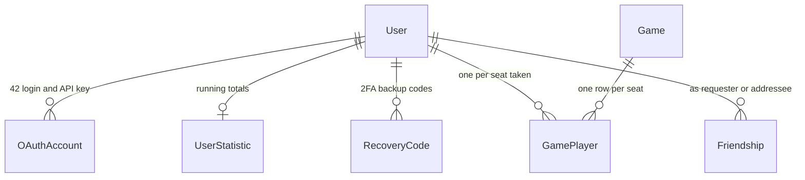

*This project has been created as part of the 42 curriculum by acaldeir, bliu, vloureir, rusilva-.*

# ft_transcendence, Uno

## Description

A web version of Uno, built as the ft_transcendence project at 42
Lisboa. Registered players create or join rooms, play live against each
other and against an AI opponent, and every finished game lands in
their match history. The official rules are the default, +4 challenge
included, with optional house rules (hand size, +2 stacking,
seven-zero) chosen when the room is created. The server owns the real
game state and each client only ever sees what it is allowed to see.

Key features: real-time remote play over WebSockets, AI opponents,
user accounts with OAuth and 2FA, stats and match history, a public
API, and a full monitoring stack with live game dashboards.

## Instructions

Prerequisites: Docker with the compose plugin, make, and the ports 8080
and 8443 free, 8080 only redirects to 8443.

1. Copy the sample environment file and adjust it for your machine:

   ```bash
   cp .env.example .env
   ```

   Important variables:

   - `POSTGRES_USER`, `POSTGRES_PASSWORD`, `POSTGRES_DB`
   - `SECRET_KEY`: JWT signing key, generate your own with
     `openssl rand -hex 32`
   - `O42_CLIENT_ID`, `O42_CLIENT_SECRET`: from an application registered
     on the 42 intra with the redirect URI
     `https://localhost:8443/api/v1/auth/42/callback`, without them the
     42 login button does not work
   - `MAIL_USERNAME`, `MAIL_PASSWORD`: a Gmail account and its app
     password, used for the activation and recovery emails, without
     them a new account never gets its activation email and cannot log in
   - `GRAFANA_ADMIN_USER`, `GRAFANA_ADMIN_PASSWORD`: Grafana login

2. Start the whole stack with one command:

   ```bash
   make all
   ```

3. Open https://localhost:8443. The certificate is self-signed, so the
   browser asks you to trust it once.

Useful targets (`make help` lists them all): `make dev` runs the site
in the foreground with the logs attached and without the monitoring
stack, `make ps` and `make log` inspect the containers, `make down`
stops them, `make clean` also removes the images and the data of this
project, and `make fclean` removes the frontend build output on top of
that. `make re` is a full rebuild, it runs `fclean` and then `all`, so
it deletes the accounts and the games as well and builds every image
again. With the stack up,
`make data` fills it with demo accounts, friendships and finished
games so the friends list and the leaderboards have content, and
`make data_clean` removes exactly what it created.

Services:

- Frontend: `https://localhost:8443`
- Backend API docs: `https://localhost:8443/docs`
- Adminer: `http://localhost:8081` (only with `make dev`, local only,
  it is not published by nginx)
- Grafana: `http://localhost:3001` (local only, never exposed by nginx)

## Team Information

All four members are Developers. The role column is the lead
responsibility each one also holds.

| Member | Login | Role | Area | Responsibilities |
| --- | --- | --- | --- | --- |
| Vinicius | vloureir | Product Owner | Frontend | Lobby, game room, card rendering, WebSocket client, settings panel, card backs, design system |
| Rui | rusilva- | Project Manager | Game core and monitoring | Rules engine (official rules, +4 challenge), game customization, engine-realtime contract, Prometheus and Grafana monitoring, live testing across the project |
| Bin | bliu | Tech Lead | Platform | Repo skeleton, one-command Docker, DB schema and ORM, auth, OAuth, 2FA, public API, stats and match history |
| Alexandre | acaldeir | Developer | Real-time and AI | WebSocket layer, per-client views, reconnection, remote players, AI opponent |

Shared by all four: Docker one-command startup, Privacy Policy and
Terms pages, and the multi-user testing.

## Project Management

We split the project by area, one owner each: platform, frontend, game
core and monitoring, and real-time with the AI. We met regularly to
line up the next steps and clear blockers, talked day to day on
WhatsApp, and did the work through GitHub pull requests, each change
reviewed before it merged. Anything that crossed two areas, like the message
contract between the engine and the socket, was agreed first and handed
to the area's owner, who opened the pull request, so each area kept one
main author in the history. We tested each other's parts against the
running stack and sent back short reports of what broke and why.

## Technical Stack

- **Backend: FastAPI (Python).** Async-friendly, first-class WebSocket
  support and pydantic validation on every message, which is the
  backbone of the game protocol.
- **Frontend: React with Material UI.** A component model that suits a
  live game board, MUI for accessible ready-made components under one
  shared theme, and Tailwind only for the global base styles.
- **Database: PostgreSQL with SQLModel/SQLAlchemy (ORM).** Relational
  data (users, games, participations) with real constraints, inspected
  via Adminer.
- **Real-time: WebSockets.** One socket per player per room. The
  server validates every action and broadcasts personalized snapshots.
- **Infrastructure: Docker Compose behind a single nginx entry point**
  (TLS termination and routing, the only exposed door).
- **Monitoring: Prometheus + Grafana** with a postgres exporter and
  provisioned dashboards and alerts.

## Database Schema

The models live in `backend/app/models/all.py`, on PostgreSQL through
the SQLModel ORM. The tables:

- **User**: the account, email, hashed password, nickname, avatar and
  the two-factor fields.
- **OAuthAccount**: a link from a user to a third-party login (42) or
  to the hashed API key.
- **Friendship**: a request between two users and its status, pending,
  accepted, rejected or blocked.
- **Game**: one finished match, its status and when it started and ended.
- **GamePlayer**: one row per seat in a game, the seat, the score, the
  winner flag and the cards left, joining a user to a game.
- **UserStatistic**: the running totals per user, games, wins, losses
  and score, that feed the leaderboards.
- **RecoveryCode**: the single-use codes handed out when 2FA is armed.

A user has many games through GamePlayer, a UserStatistic row from
the first finished game on, many friendships, and its OAuth and
recovery links:



## Features List

| Feature | Who | What it does |
| --- | --- | --- |
| Uno rules engine | Rui | Every move validated in one place: official rules, +4 bluff and challenge, scoring |
| Game customization | Rui | Hand size, +2 stacking, seven-zero, room size, public/private rooms |
| Wire protocol | Rui | Typed message contract between server and browser, per-player snapshots, error codes |
| Monitoring | Rui | Prometheus metrics, two Grafana dashboards, alert rules |
| Realtime rooms | Alexandre | Rooms over WebSockets, seats, reconnection with grace periods, broadcasting |
| Remote players | Alexandre | Full game playable from different machines |
| AI opponent | Alexandre | Bots that take seats and play by the rules |
| User management | Bin | Signup/login, profiles, avatars, friends, online status |
| OAuth + 2FA | Bin | Third-party login and two-factor authentication |
| Public API | Bin | Documented endpoints with API key and rate limiting |
| Stats and match history | Bin | Every finished game recorded, per-user stats |
| Game UI | Vinicius | Lobby, table, cards, turn indicators, wild color pick |
| Design system | Vinicius | Reusable MUI components, shared palette and typography, card back selection |

## Modules

24 points implemented, well above the 14 the subject requires.

| Module | Type | Points | Who |
| --- | --- | --- | --- |
| Web game (play against each other) | major | 2 | Rui, Alexandre, Vinicius |
| Multiplayer (3+ players) | major | 2 | Rui, Alexandre, Vinicius |
| Remote players | major | 2 | Alexandre |
| AI opponent | major | 2 | Alexandre |
| Frameworks, frontend + backend | major | 2 | Bin, Vinicius |
| Real-time with WebSockets | major | 2 | Alexandre |
| Standard user management | major | 2 | Bin |
| Public API | major | 2 | Bin |
| Monitoring (Prometheus + Grafana) | major | 2 | Rui |
| ORM | minor | 1 | Bin |
| Game customization options | minor | 1 | Rui, Vinicius |
| Stats and match history | minor | 1 | Bin |
| Design system (10 components) | minor | 1 | Vinicius |
| OAuth (42) | minor | 1 | Bin |
| Two-factor authentication | minor | 1 | Bin |

**Total: 24 points** (9 majors, 6 minors).

One line each, for the defense:

- **Web game**: Uno played live against each other, official rules and a clear win.
- **Multiplayer 3+**: Uno is natively two to four, tables of three or four play.
- **Remote players**: a full game from separate machines, with reconnection.
- **AI opponent**: bots that take seats and play by the rules, at three difficulties.
- **Frameworks**: React on the front, FastAPI on the back.
- **Real-time WebSockets**: every action over a socket, a personalized state to each player.
- **User management**: profiles, avatar upload, friends with online status.
- **Public API**: documented endpoints behind an API key with rate limiting.
- **Monitoring**: Prometheus and Grafana with dashboards and alert rules.
- **ORM**: SQLModel over PostgreSQL, no raw SQL.
- **Game customization**: hand size, +2 stacking, seven-zero and room settings.
- **Stats and match history**: every finished game recorded, per-user totals and leaderboards.
- **Design system**: reusable components with a palette and typography.
- **OAuth**: sign in with your 42 account.
- **Two-factor**: TOTP codes with single-use recovery codes.

## Individual Contributions

**Rui, game core and monitoring.** Wrote the rules engine
(`backend/app/game/engine.py`): every Uno rule in one pure, seedable
module, including the +4 bluff/challenge and the house
rules. Defined the wire contract (`backend/app/game/contract.py`) that
the realtime layer and the frontend both build on, and the per-player
snapshot design that keeps hands secret. Built the monitoring stack:
Prometheus scraping the backend and a postgres exporter, two
provisioned Grafana dashboards and the alert rules. Also the team
tester: exercised each new feature live against the running stack and
hunted down bugs across all areas, from the frontend to the database
recording, reporting each one to its owner. Challenges: the +4
legality had to be frozen at play time so later draws could not change
the verdict, and the Uno call was redesigned as its own message racing
the catch, with a server-side grace window.

**Bin, platform.**
Built the platform the game stands on: the repo skeleton, the
one-command Docker Compose setup, the database models and the SQLModel
ORM layer. Authentication with hashed and salted passwords and JWT
cookies, plus the sign in with 42 and complete two-factor with TOTP
and single-use recovery codes. User management: profiles, avatar
upload, the friends system with requests and online presence. The
public API behind an API key with rate limiting. The stats, match
history and leaderboards, the email service for verification and
password reset, and the bot accounts the AI seats play under, created
at startup. Challenges: growing a full-stack template into our own
auth flow without dragging its dead weight along, and keeping the 42
login alive through an expired application secret and the quirks of
the intra callback.

**Vinicius, frontend.**
Built the browser client: home, login, register and the account
screens, the lobby and join screens, and the game room with the card
rendering, the turn indicators, the wild color pick and the seven
target pick, the winner screen and the reaction bubbles. The
WebSocket client that drives the table, the profile and avatar upload,
the stats and leaderboard screens, the API key screen, and the site
theme and the design system components with Material UI. Challenges:
learning TypeScript and React on the project itself, and driving the
whole table from a single WebSocket state feed with React 19, where
the usual socket libraries did not fit and the client had to be
written by hand.

**Alexandre, real-time and AI.**
Built the realtime layer that runs the rooms: seats, per-player
broadcasting, reconnection with grace periods, one seat per player
across rooms, authentication on the socket, the turn clock, the
lobby with add-bot and kick, recording of finished games to the
database, and the game metrics that feed the monitoring. The AI
opponent that fills the bot seats is his as well, with its three
difficulty levels playing from easy and random up to a tactical hard.
Challenges: keeping every client's view consistent through drops and
reconnections without ever leaking a hand, and pacing the bots so they
play at a human rhythm without blocking the room for anyone else.

## Resources

The references the team worked from.

- Official Uno rules: <https://www.mattelgames.com/en-us/cards/uno>,
  what the engine implements, +4 challenge included.
- pwdlib with Argon2 and Bcrypt: password hashing.
- pyotp: <https://pyauth.github.io/pyotp/> and qrcode.react, the
  two-factor codes and the setup QR.
- 42 intra OAuth: <https://api.intra.42.fr/apidoc>, the sign in with 42.
- React Router: <https://reactrouter.com/>, the client-side routes.
- FastAPI: <https://fastapi.tiangolo.com/>, the backend framework,
  including its WebSocket support.
- FastAPI full-stack template:
  <https://github.com/fastapi/full-stack-fastapi-template> (MIT), the
  starting point of the auth and user layer, grown into our own.
- Pydantic: <https://docs.pydantic.dev/>, validation of every message
  in the game protocol.
- SQLModel: <https://sqlmodel.tiangolo.com/>, the ORM over SQLAlchemy.
- PostgreSQL: <https://www.postgresql.org/docs/>.
- React: <https://react.dev/>, Material UI: <https://mui.com/>, and
  Tailwind CSS: <https://tailwindcss.com/docs>, the base styles.
- MDN WebSocket API: <https://developer.mozilla.org/en-US/docs/Web/API/WebSocket>,
  the client side of the realtime connection.
- Prometheus: <https://prometheus.io/docs/> and Grafana provisioning:
  <https://grafana.com/docs/grafana/latest/administration/provisioning/>,
  the monitoring stack as files in git.
- prometheus-fastapi-instrumentator and postgres-exporter, the two
  metric exporters.
- JWT: <https://datatracker.ietf.org/doc/html/rfc7519>, the signed
  login cookie that the backend and the game socket both verify.
- Docker Compose: <https://docs.docker.com/compose/> and nginx:
  <https://nginx.org/en/docs/>, the deployment.

### AI usage

AI was used to support specific aspects of the project, namely:

- Clarifying a few doubts about the project requirements and the
  scope of the chosen modules.
- Answering questions about concepts such as WebSocket communication,
  per-player game state, JWT sessions, OAuth and two-factor flows,
  ORM relations, React rendering, Tailwind utility classes, and
  monitoring with Prometheus and Grafana.
- Getting a second opinion on the initial architecture and the split
  between the game engine, the realtime layer and the frontend.
- Discussing and evaluating different approaches to dividing the work
  between team members.
- Assisting with debugging by explaining error messages and pointing
  to likely causes.
- Suggesting possible optimizations to some parts of the code.
- Structuring and drafting the README.
